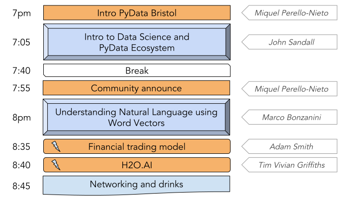

# PyData Bristol - 1st Meetup

## Schedule

  

## Slides and recordings

- [Welcome to PyData Bristol][slides:mpn] by Miquel Perelló Nieto ([watch on YouTube][video:mpn])
- [A brief introduction to data science, machine learning and the PyData
  ecosystem][slides:js] by John Sandall
- [Welcome to OVO][slides:gc] by George Carter
- [Understanding natural language with word vectors][slides:mb] by Marco Bonzanini
- [Experiences with XGBoost and the financial markets][slides:as] by Adam Smith

[slides:mpn]: ./pydata_bristol_01_intro_miquel_perello_nieto.pdf
[slides:js]: ./pydata_bristol_02_ds_and_ml_john_sandall.pdf
[slides:gc]: ./pydata_bristol_03_ovo_george_carter.pdf
[slides:mb]: ./pydata_bristol_04_wordembeddings_marco_bonzanini.pdf
[slides:as]: ./pydata_bristol_05_xgboost_adam_smith.pdf
[video:mpn]: https://youtu.be/wgZB7jyilpE

## Meetup event page

https://www.meetup.com/PyData-Bristol/events/247814072/

## Sponsors

  
  

