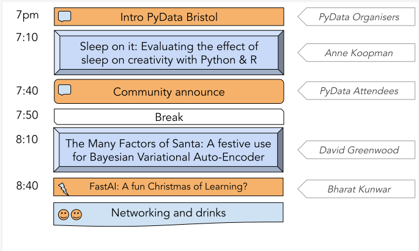

# PyData Bristol - 13th Meetup

## Schedule

  

## Slides and recordings

- [Welcome to PyData Bristol][slides:1] by Miquel Perelló Nieto, Frank Kelly,
John Sandall, David Greenwood, James C Yarrow, Lenka Hašová and Bharat Kunwar
- [Sleep on it: Evaluating the effect of sleep on creativity with Python & R][slides:2] **(to be added)** by Anne Koopman
- [The Many Factors of Santa: A festive use for Bayesian Variational Auto-Encoder)][slides:3] **(to be added)** by David Greenwood
- [FastAI: A fun Christmas of Learning?][slides:4] **(to be added)** by Bharat Kunwar

[slides:1]: ./pydata_bristol_1.pdf
[slides:2]:  ./pydata_bristol_2.pdf
[slides:3]:  ./pydata_bristol_3.pdf
[slides:4]:  ./pydata_bristol_4.pdf
[slides:5]:  ./pydata_bristol_5.pdf

## Meetup event page

https://www.meetup.com/PyData-Bristol/events/266864770/

## Sponsors

  
  

