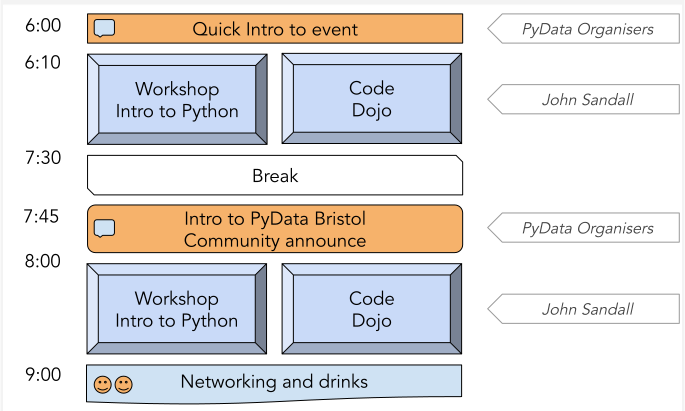

# PyData Bristol - 14th Meetup

## Schedule

  

## Slides and recordings

- [Welcome to PyData Bristol][slides:1] by Miquel Perelló Nieto, Frank Kelly,
John Sandall, David Greenwood, James C Yarrow, Lenka Hašová and Bharat Kunwar
- [Workshop: Introduction to Python][workshop] by John Sandall

[slides:1]: ./pydata_bristol_1.pdf
[workshop]: https://github.com/pydatabristol/workshops/tree/master/workshop_2020_01_23_intro_to_python

## Meetup event page

https://www.meetup.com/PyData-Bristol/events/267902147/

## Sponsors

  
  
  

