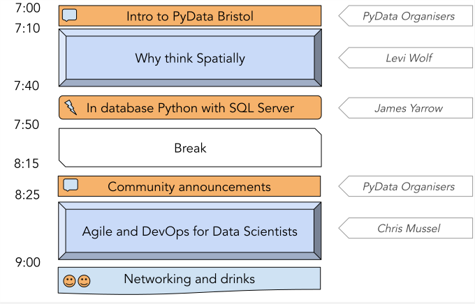

# PyData Bristol - 15th Meetup

## Schedule

  

## Slides and recordings

- [Welcome to PyData Bristol][slides:1] by Miquel Perelló Nieto, Frank Kelly,
John Sandall, David Greenwood, James C Yarrow, Lenka Hašová and Bharat Kunwar
- [Why think Spatially][slides:2] by Levi Wolf
- [In database Python with SQL Server][slides:3] by James C Yarrow
- [Agile and DevOps for Data Scientists][slides:4] by Chris Mussel

[slides:1]: ./pydata_bristol_1.pdf
[slides:2]: ./pydata_bristol_2.pdf
[slides:3]: ./pydata_bristol_3.pdf
[slides:4]: ./pydata_bristol_4.pdf

## Meetup event page

https://www.meetup.com/PyData-Bristol/events/268081062/

## Sponsors

  
  
  

