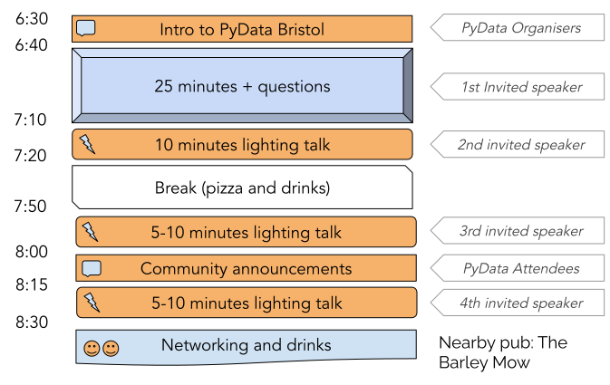

# PyData Bristol - 17th Meetup

## Schedule

  

## Slides

- [Welcome to PyData Bristol][slides:1] by PyData Organisers
- [Optimization Methods in Python][slides:2] by Sudarsan Balaji
- [Data Science Pipeline Using DVC and VSCode][slides:3] by Alon Samuel
- [Tsetlin Machines][slides:4] by Frank Kelly
- [Explainable Boosting Machines][slides:5] by Alistair Rogers

[slides:1]: ./pydata_bristol_1.pdf
[slides:2]:  ./pydata_bristol_2.pdf
[slides:3]:  ./pydata_bristol_3.pdf
[slides:4]:  ./pydata_bristol_4.pdf
[slides:5]:  ./pydata_bristol_5.pdf

## Meetup event page

https://www.meetup.com/pydata-bristol/events/288874048/

## Sponsors

  
  
  

