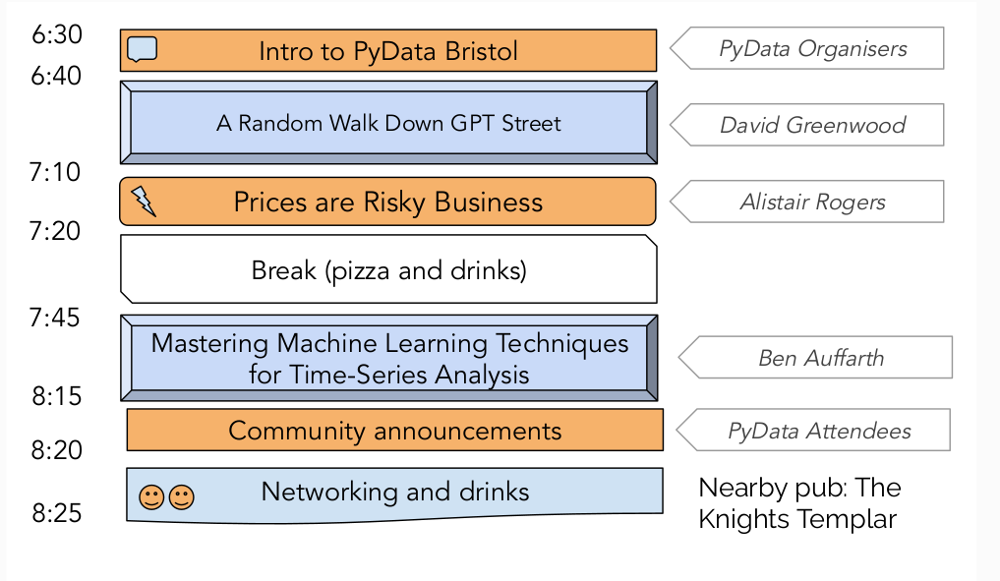

# PyData Bristol - 17th Meetup

## Schedule

  

## Slides

- [Welcome to PyData Bristol][slides:1] by PyData Organisers
- [A Random Walk Down GPT Street][slides:2] by David Greenwood
- [Prices are Risky Business][slides:3] by Alistair Rogers
- [Mastering Machine Learning Techniques for Time-Series Analysis][slides:4] by Ben Auffarth

[slides:1]: ./01_intro.pdf
[slides:2]:  ./02_Random_Walk_GPT_Street.pdf
[slides:3]:  ./03_Prices_are_Risky_Business.pdf
[slides:4]:  ./04_Machine_Learning_for_Time-Series_-_Pydata_Bristol.pdf

## Meetup event page

https://www.meetup.com/pydata-bristol/events/288874048/

## Sponsors

  
  
  

