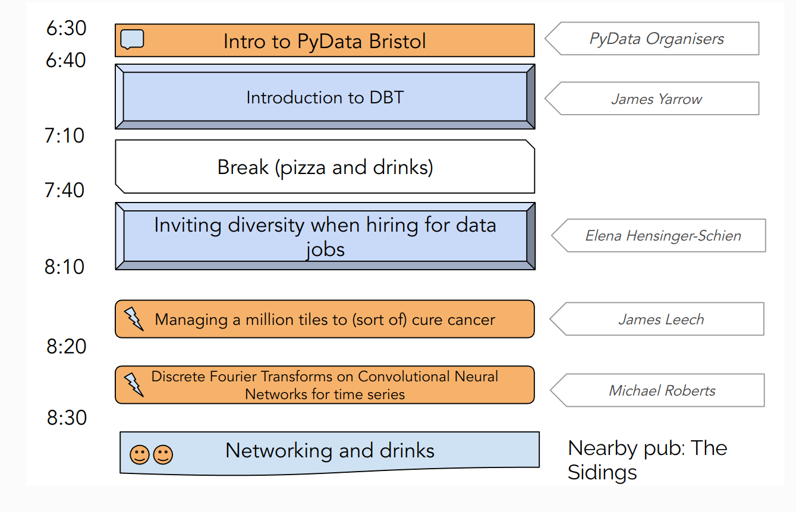

# PyData Bristol - 24nd Meetup

## Schedule

  

## Slides

- [Welcome to PyData Bristol][slides:1] by PyData Organisers
- [Hiring for diversity][slides:3] by Dr Elena Hensinger-Schien
- [Signal Processing with CNN][slides:4] by Michael Roberts
- [Managing a million tiles to (sort of) cure cancer][slides:5] by James Leech

[slides:1]: ./01_Intro.pdf
[slides:2]:  ./02_Random_Walk_GPT_Street.pdf
[slides:3]:  ./03_Inviting_diversity_when_hiring_for_data_jobs.pdf
[slides:4]:  ./04_Signal_Processing_with_CNNs.pdf
[slides:5]:  ./05_Managing_a_Million_tiles_to_(sort_of)_cure_cancer.pdf

## Meetup pages

https://www.meetup.com/PyData-Bristol/ 

https://www.meetup.com/pydata-bristol/events/293860053/ 

## Sponsors

  
  
  

