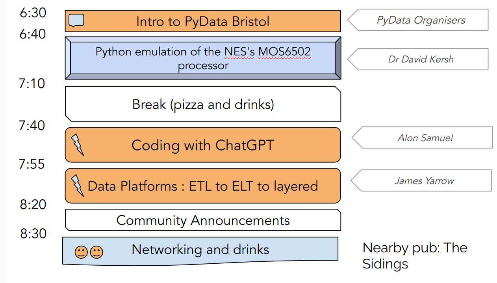

# PyData Bristol - 25th Meetup

## Schedule

  

## Slides

- [Welcome to PyData Bristol][slides:1] by PyData Organisers
- [Python emulation of the NES's MOS6502 processor][slides:2] by Dr David Kersh 
- [Coding with ChatGPT][slides:3] by Alon Samuel

[slides:1]: ./01_Intro.pdf
[slides:2]:  ./02_MOS6502.pdf
[slides:3]:  ./03_Coding_with_ChatGPT.pdf

## Meetup pages

https://www.meetup.com/PyData-Bristol/ 

https://www.meetup.com/pydata-bristol/events/294598637/ 

## Sponsors

  
  
  

