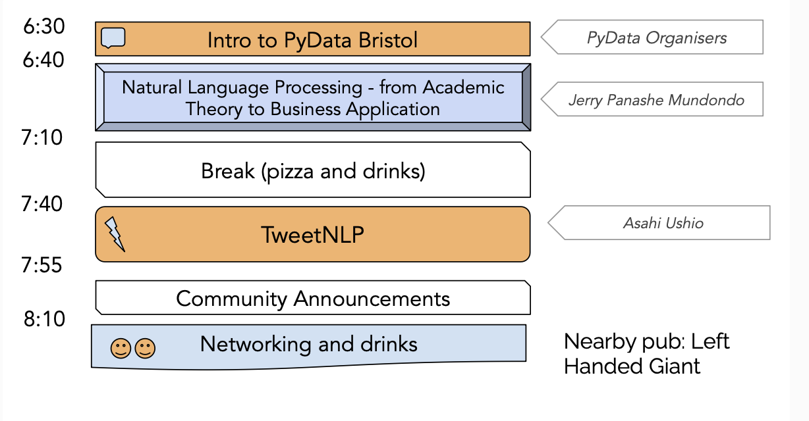
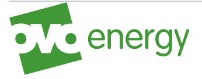

# PyData Bristol - 25th Meetup

## Schedule

  

## Slides

- [Welcome to PyData Bristol][slides:1] by PyData Organisers
- [Natural Language Processing - from Academic Theory to Business Application][slides:2] by Jerry Panashe Mundondo 
- [TweetNLP][slides:3] by Asahi Ushio
- [Polars Intro][slides:3] by Alon Samuel

[slides:1]: ./01_Intro.pdf
[slides:2]:  ./02_NLP_Academia_to_business.pdf
[slides:3]:  ./03_TweetNLP.pdf
[slides:4]:  ./04_PolarsIntro.pdf

## Meetup pages

https://www.meetup.com/PyData-Bristol/ 

https://www.meetup.com/pydata-bristol/events/296142623/ 

## Sponsors

  
  
  

