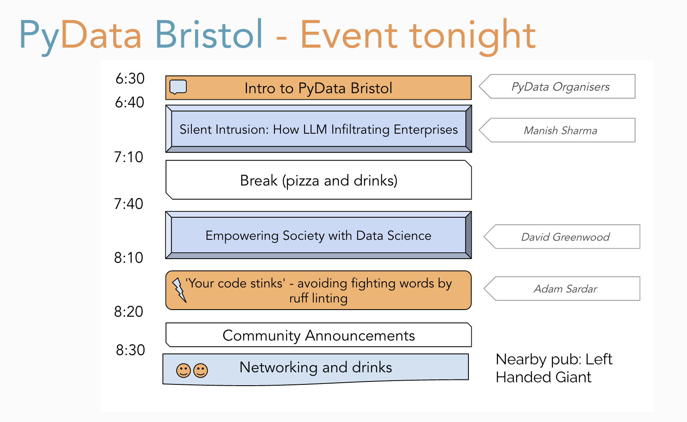

# PyData Bristol - 26th Meetup

## Schedule

  

## Slides

- [Welcome to PyData Bristol](./01_Intro.pdf) by PyData Organisers
- [LLMs Infiltrating Enterprises](./02_LLMs_Infiltrating_Enterprises.pdf) by Manish Sharma
- [Empowering Society with Data Science](./03_Empowering_Society_with_Data_Science.pdf) by David Greenwood
- ['Your code stinks' - avoiding fighting words by ruff linting by Adam Sardar.](./04_ruff_linting.md) 
 

## Meetup pages

https://www.meetup.com/PyData-Bristol/ 

## Sponsors

  
  
  

