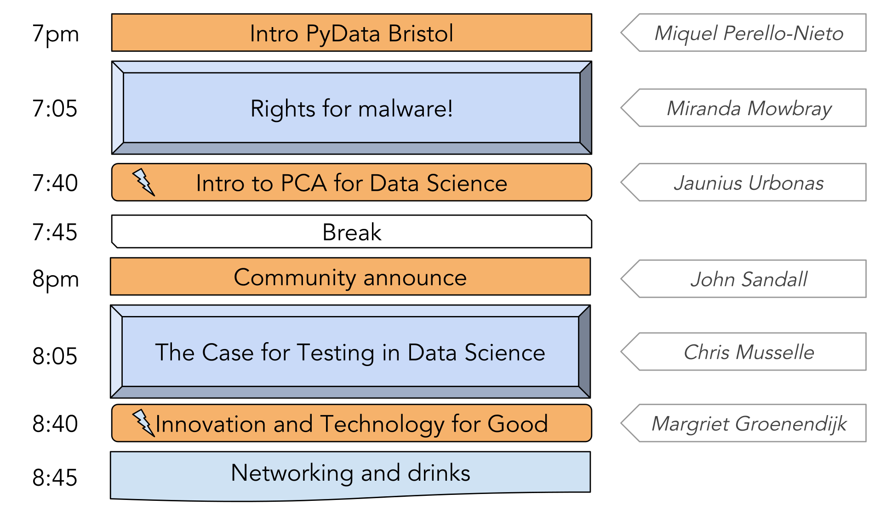
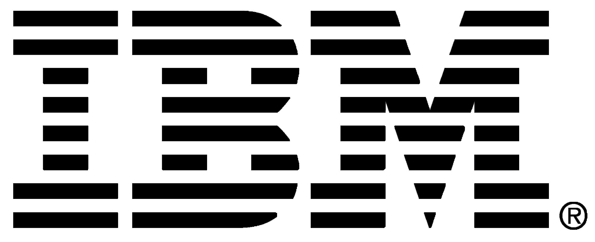
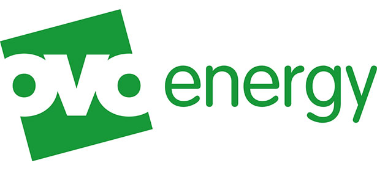

# PyData Bristol - 3rd Meetup

## Schedule

  

## Slides and recordings

- [Welcome to PyData Bristol][slides:mpn] by Miquel Perelló Nieto
- [Rights for malware!][slides:mm] by Miranda Mowbray
- [PCA application creating recomender engine][slides:ju] by Jaunius Urbonas
- [The case for testing in Data Science][slides:cm] by Chris Musselle
- [Call for Code: Innotvation and technology for good][slides:mg] by Margriet Groenendijk

[slides:mpn]: ./pydata_bristol_01_intro_miquel_perello_nieto.pdf
[slides:mm]:  ./pydata_bristol_02_rfm_miranda_mowbray.pdf
[slides:ju]:  ./pydata_bristol_03_pca_jaunius_urbonas.pdf
[slides:cm]:  ./pydata_bristol_04_testing_chris_musselle.pdf
[slides:mg]:  ./pydata_bristol_05_ibm_margriet_groenendijk.pdf

## Meetup event page

https://www.meetup.com/PyData-Bristol/events/252503849/

## Sponsors

  
  
  

