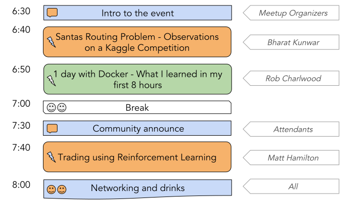
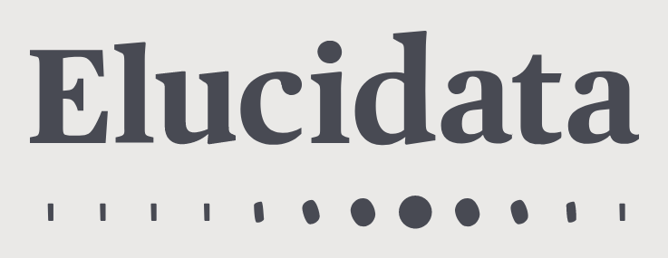

# PyData Bristol - Christmas joint event with DBBUG

## Schedule

  

## Slides and recordings

- [Welcome to Christmas join PyData Bristol and DBBUG][slides:mpn] by Miquel Perelló Nieto
- [Santas Routiung Prolem -- Observations on a Kaggle Competition][slides:bk] by Bharat Kunwar
- [1 day with Docker - What I learned in my first 8 hours][slides:rc] by Rob Charlwood
- [Trading using Reinforcement Learning][slides:mh] by Matt Hamilton

[slides:mpn]: ./pydata_bristol_01_mpn.pdf
[slides:bk]:  ./pydata_bristol_02_bk.pdf
[slides:rc]:  ./pydata_bristol_03_rc.pdf
[slides:mh]:  ./pydata_bristol_04_mh.pdf

## Meetup event page

https://www.meetup.com/PyData-Bristol/events/256838903

## Sponsors

  
  
  

